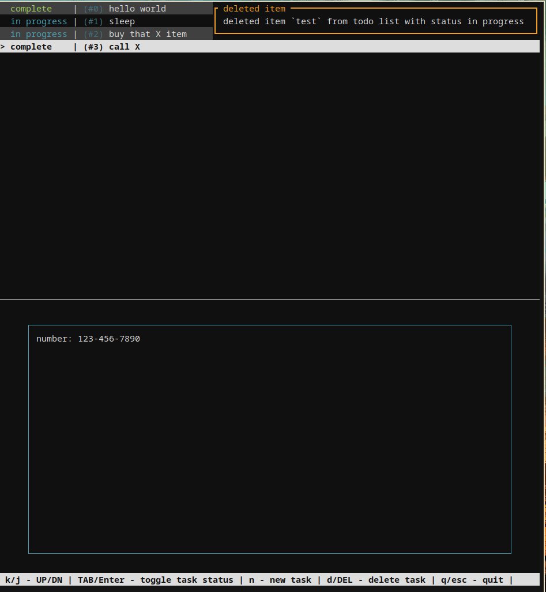

# toodu
my first rust application so be gentle

a todo application written in rust with TUI, uses `ratatui` and `corssterm`

## paused 
development is currently paused, the current state of working with `ratatui` and inputs
is just not there and very limiting, maybe will continue working on that in the future

